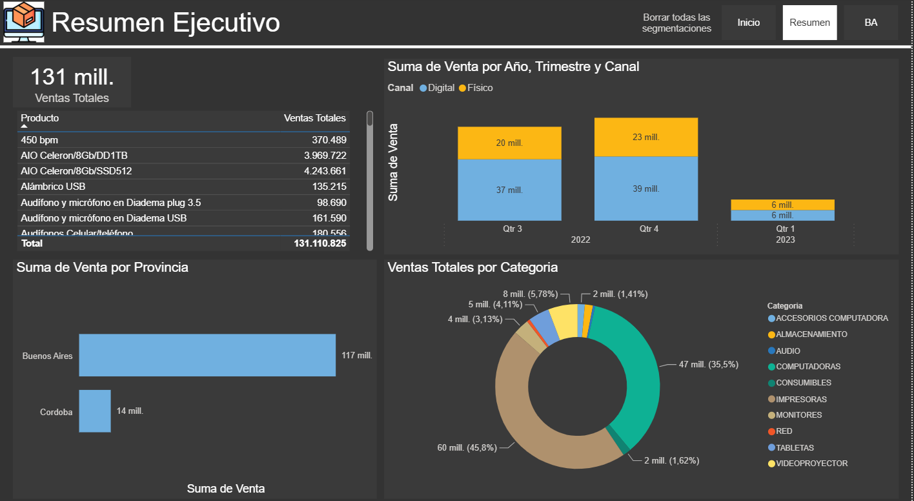
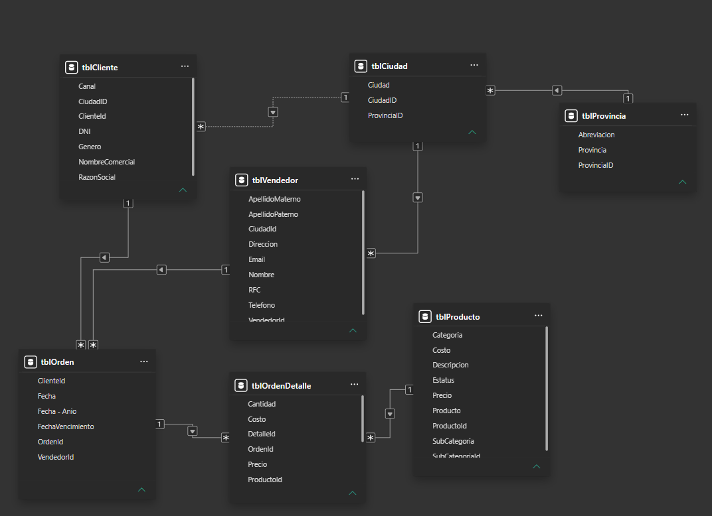
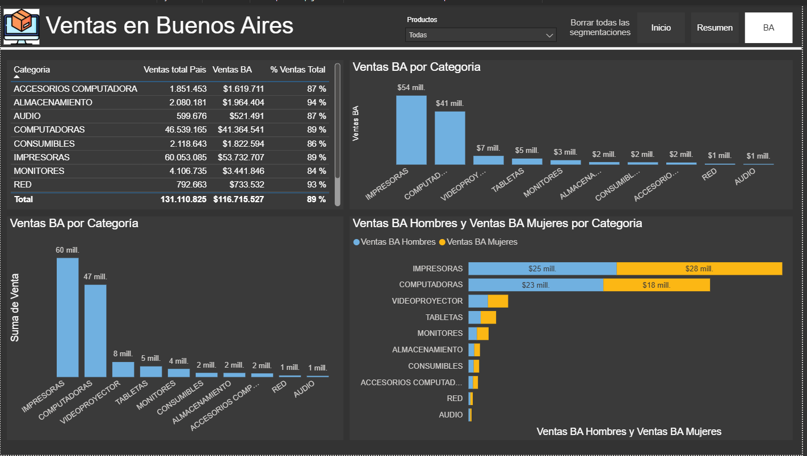

[← Volver al portafolio](/)

# Dashboard de Ventas: Resumen Ejecutivo & Análisis Regional

Power BISQL ServerPower QueryDAXModelado de datosStorytelling

131 mill.en ventas totales

89%concentrado en Buenos Aires

10categorías de producto

2niveles de análisis

## 📝 Descripción general

> Se desarrolló un reporte de **Business Intelligence** en **Microsoft Power BI** para centralizar y analizar la información comercial de una empresa de venta de tecnología. El proyecto permite monitorear el desempeño de ventas desde una visión ejecutiva hasta un análisis regional detallado, facilitando la toma de decisiones basada en datos.

## 🎯 Objetivos del proyecto

- Centralizar información comercial dispersa en una **fuente única de verdad**.
- Monitorear el desempeño de ventas por año, trimestre, canal, categoría y región.
- Permitir un **drill-down** desde la visión nacional hasta el análisis regional (Buenos Aires).
- Facilitar la navegación entre páginas manteniendo el contexto del usuario.

## 🛠️ Metodología y proceso

### 1. Fuente de datos

- Extracción directa desde **base de datos SQL** con información transaccional.
- Campos clave: productos, categorías, provincias, canales y fechas de transacción.

### 2. ETL con Power Query

- Conexión y extracción de datos desde SQL Server.
- Limpieza y normalización de campos de producto, categoría y ubicación geográfica.
- Construcción de una **tabla de fechas** (calendario) para habilitar análisis temporal por trimestre.

### 3. Modelado de datos

- Modelo en **estrella** con tabla de hechos de ventas vinculada a dimensiones:
    - Producto
    - Categoría
    - Provincia
    - Fecha
- Optimización del rendimiento de consultas y navegación entre páginas.

### 4. Desarrollo de medidas DAX

- Medida de **venta total** acumulada.
- **Participación porcentual** por categoría sobre el total.
- Comparativas segmentadas por **género y categoría** de producto en la vista regional.
- Medidas con contexto de filtro dinámico para mantener coherencia entre páginas.

### 5. Visualización y storytelling

- **Resumen Ejecutivo**: visión general de ventas por año/trimestre/canal, top productos, distribución geográfica y por categoría.
- **Vista Buenos Aires**: drill-down específico con participación sobre el total país, desglose por categoría y género.
- **Navegación entre páginas** con segmentaciones persistentes para no perder contexto.

## ✨ Características destacadas del reporte

| Característica | Descripción |
| --- | --- |
| Vista nacional | Resumen ejecutivo con KPIs, tendencias y distribución |
| Drill-down regional | Análisis profundo de Buenos Aires vs. resto del país |
| Análisis temporal | Desglose por año y trimestre con tabla de fechas dedicada |
| Segmentación persistente | Los filtros se mantienen al navegar entre páginas |
| Storytelling visual | Flujo narrativo de lo general a lo particular |

## 🧰 Stack técnico

Microsoft Power BI DesktopSQL Server (fuente de datos)Power Query (ETL y transformación)DAX (Data Analysis Expressions)Modelo estrella (hechos + dimensiones)Navegación multi-página con segmentaciones sincronizadas

## 🚀 Habilidades demostradas

- Conexión y extracción de datos desde bases relacionales (SQL).
- Diseño de modelos estrella optimizados para BI.
- Desarrollo de medidas DAX con contexto de filtro avanzado.
- Construcción de tablas de fechas para análisis temporal.
- Diseño de experiencia de usuario con navegación entre páginas.
- Storytelling visual: de la visión general al detalle regional.
- Segmentaciones persistentes y sincronización de filtros.

## 📌 Resultado

Un reporte de BI de dos niveles que permite a los stakeholders:

1. **Entender el panorama general** del negocio (Resumen Ejecutivo).
2. **Profundizar en el mercado clave** (Buenos Aires) sin perder el contexto nacional.

La arquitectura del reporte, el modelo de datos y la navegación fueron diseñados para escalar: se pueden agregar nuevas regiones siguiendo el mismo patrón de drill-down.

 

[← Volver al portafolio](/)
